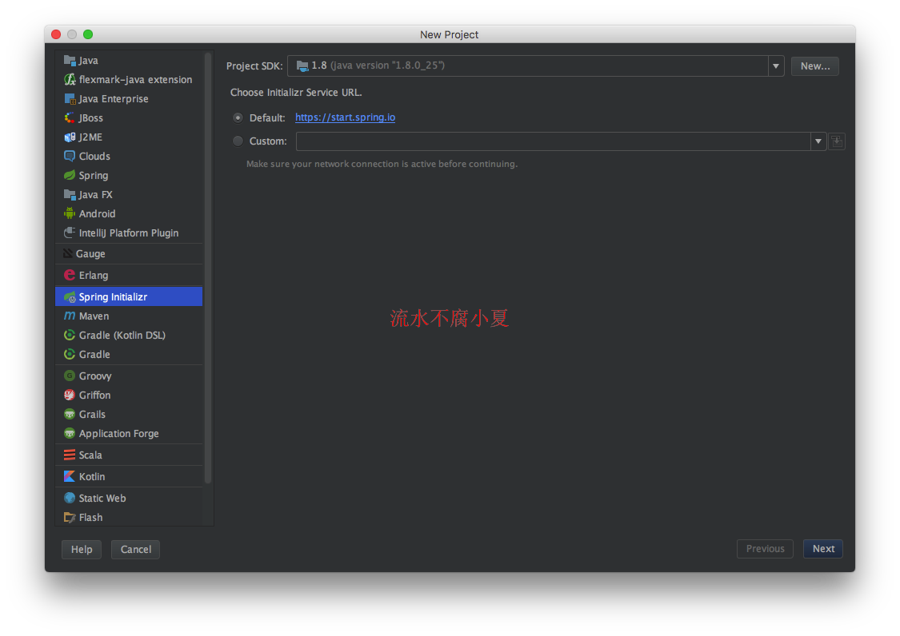
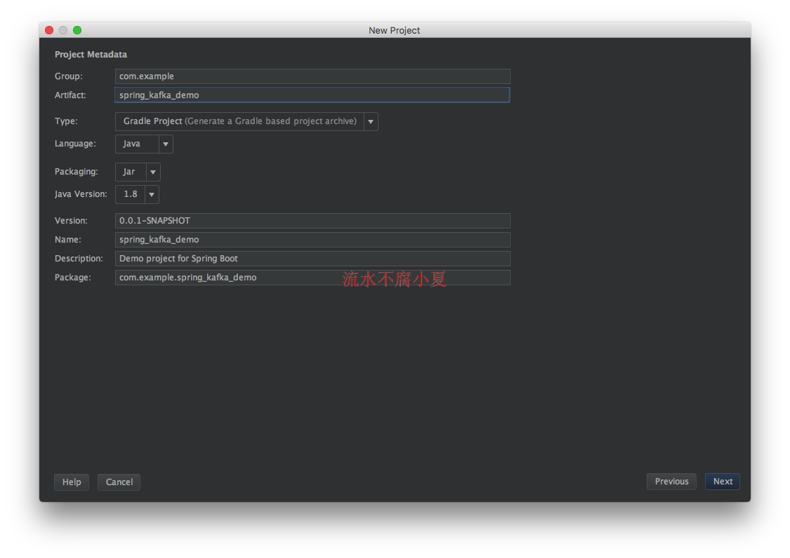
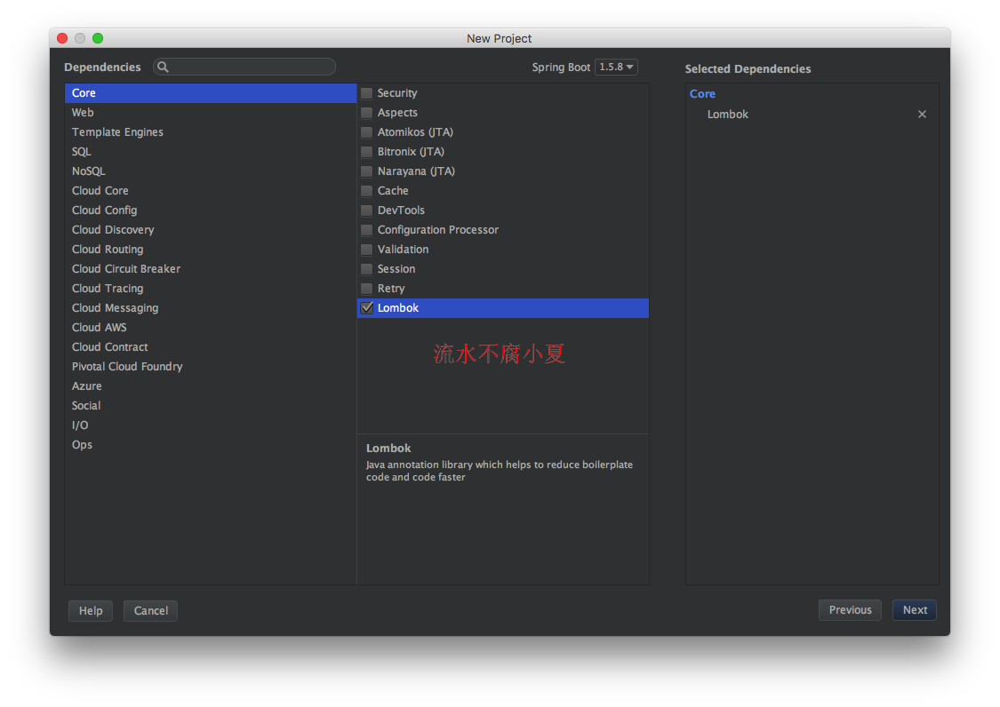
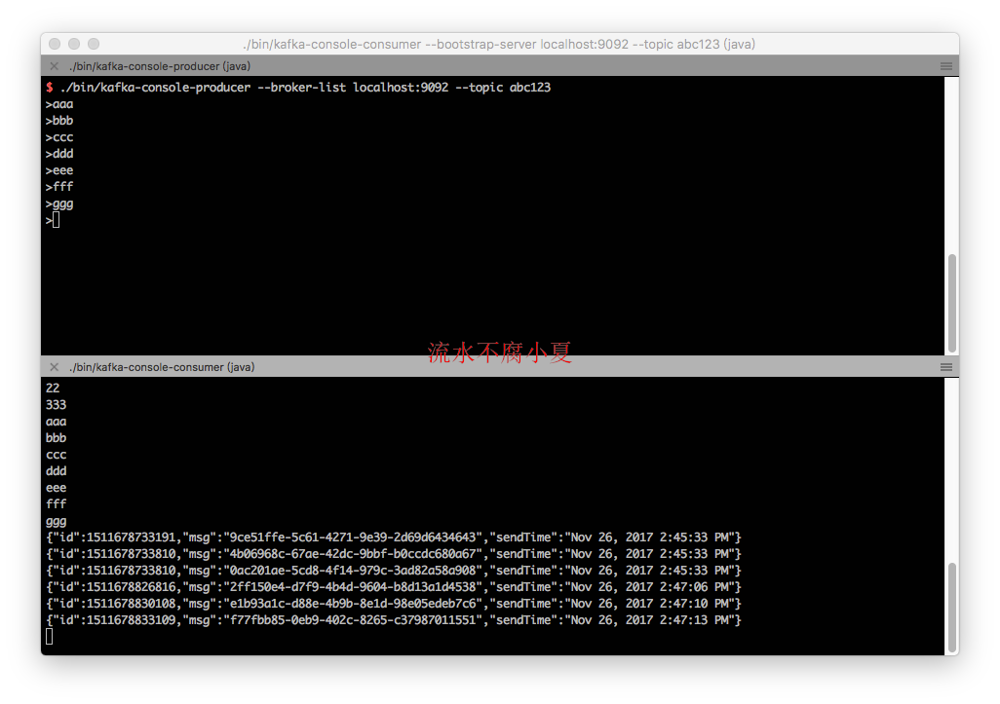

# Spring Boot集成Kafka

<!-- TOC -->

- [Spring Boot集成Kafka](#spring-boot集成kafka)
    - [前提介绍](#前提介绍)
    - [Kafka](#kafka)
        - [简介](#简介)
        - [Topics & logs](#topics--logs)
        - [Distribution](#distribution)
        - [Producers](#producers)
        - [Consumers](#consumers)
        - [Guarantees](#guarantees)
    - [Kafka安装与使用](#kafka安装与使用)
        - [安装](#安装)
        - [服务启动](#服务启动)
        - [Topic](#topic)
        - [消息发送与消费](#消息发送与消费)
    - [Spring Boot集成](#spring-boot集成)
        - [开始](#开始)
        - [配置](#配置)
        - [代码](#代码)
    - [总结](#总结)
    - [参考资料](#参考资料)

<!-- /TOC -->

---

## 前提介绍

由于公司使用了微服务架构，很多业务拆成了很多小模块。
有个场景是这样的A服务主要负责写入或者修改数据库中的数据，B服务主要负责读取，B服务使用缓存技术，当A发生了修改后，需要通知B来清除缓存。
中间两个服务之间通知使用了Kafka，这个是本篇文章主要介绍的，关于 [缓存技术](https://github.com/LiushuiXiaoxia/SpringCacheDemo) 我也简单介绍过。

## Kafka


### 简介

[Kafka官网](https://kafka.apache.org/intro)

Kafka is a distributed,partitioned,replicated commit logservice。它提供了类似于JMS的特性，但是在实现上完全不同，此外它并不是JMS规范的实现。
kafka对消息保存时根据Topic进行归类，发送消息者成为Producer,消息接受者成为Consumer,此外kafka集群有多个kafka实例组成，每个实例成为broker。
无论是kafka集群，还是producer和consumer都依赖于zookeeper来保证系统可用性集群保存一些meta信息。


### Topics & logs

一个Topic可以认为是一类消息，每个topic将被分成多个partition(区),每个partition在存储层面是append log文件。任何发布到此partition的消息都会被直接追加到log文件的尾部，每条消息在文件中的位置称为offset（偏移量），offset为一个long型数字，它是唯一标记一条消息。它唯一的标记一条消息。kafka并没有提供其他额外的索引机制来存储offset，因为在kafka中几乎不允许对消息进行“随机读写”。


 kafka和JMS（Java Message Service）实现(activeMQ)不同的是:即使消息被消费,消息仍然不会被立即删除.日志文件将会根据broker中的配置要求,保留一定的时间之后删除;比如log文件保留2天,那么两天后,文件会被清除,无论其中的消息是否被消费.kafka通过这种简单的手段,来释放磁盘空间,以及减少消息消费之后对文件内容改动的磁盘IO开支.

对于consumer而言,它需要保存消费消息的offset,对于offset的保存和使用,有consumer来控制;当consumer正常消费消息时,offset将会"线性"的向前驱动,即消息将依次顺序被消费.事实上consumer可以使用任意顺序消费消息,它只需要将offset重置为任意值..(offset将会保存在zookeeper中,参见下文)

kafka集群几乎不需要维护任何consumer和producer状态信息,这些信息有zookeeper保存;因此producer和consumer的实现非常轻量级,它们可以随意离开,而不会对集群造成额外的影响.

partitions的目的有多个.最根本原因是kafka基于文件存储.通过分区,可以将日志内容分散到多个上,来避免文件尺寸达到单机磁盘的上限,每个partiton都会被当前server(kafka实例)保存;可以将一个topic切分多任意多个partitions,来消息保存/消费的效率.此外越多的partitions意味着可以容纳更多的consumer,有效提升并发消费的能力.(具体原理参见下文).

### Distribution

一个Topic的多个partitions,被分布在kafka集群中的多个server上;每个server(kafka实例)负责partitions中消息的读写操作;此外kafka还可以配置partitions需要备份的个数(replicas),每个partition将会被备份到多台机器上,以提高可用性.

基于replicated方案,那么就意味着需要对多个备份进行调度;每个partition都有一个为"leader";leader负责所有的读写操作,如果leader失效,那么将会有其他follower来接管(成为新的leader);follower只是单调的和leader跟进,同步消息即可..由此可见作为leader的server承载了全部的请求压力,因此从集群的整体考虑,有多少个partitions就意味着有多少个"leader",kafka会将"leader"均衡的分散在每个实例上,来确保整体的性能稳定.

###  Producers

Producer将消息发布到指定的Topic中,同时Producer也能决定将此消息归属于哪个partition;比如基于"round-robin"方式或者通过其他的一些算法等.

###  Consumers

本质上kafka只支持Topic.每个consumer属于一个consumer group;反过来说,每个group中可以有多个consumer.发送到Topic的消息,只会被订阅此Topic的每个group中的一个consumer消费.

如果所有的consumer都具有相同的group,这种情况和queue模式很像;消息将会在consumers之间负载均衡.
如果所有的consumer都具有不同的group,那这就是"发布-订阅";消息将会广播给所有的消费者.
在kafka中,一个partition中的消息只会被group中的一个consumer消费;每个group中consumer消息消费互相独立;我们可以认为一个group是一个"订阅"者,一个Topic中的每个partions,只会被一个"订阅者"中的一个consumer消费,不过一个consumer可以消费多个partitions中的消息.kafka只能保证一个partition中的消息被某个consumer消费时,消息是顺序的.事实上,从Topic角度来说,消息仍不是有序的.

kafka的原理决定,对于一个topic,同一个group中不能有多于partitions个数的consumer同时消费,否则将意味着某些consumer将无法得到消息.

###  Guarantees

* 发送到partitions中的消息将会按照它接收的顺序追加到日志中

* 对于消费者而言,它们消费消息的顺序和日志中消息顺序一致.

* 如果Topic的"replicationfactor"为N,那么允许N-1个kafka实例失效.

## Kafka安装与使用

### 安装

我使用的是Mac，下面介绍如何使用安装。

```sh
brew update

brew install kafka
```

结果

```sh
To have launchd start kafka now and restart at login:
  brew services start kafka
Or, if you don't want/need a background service you can just run:
  zookeeper-server-start /usr/local/etc/kafka/zookeeper.properties & kafka-server-start /usr/local/etc/kafka/server.properties
==> Summary
🍺  /usr/local/Cellar/kafka/0.11.0.1: 149 files, 35.5MB
```

结果显示，需要有2个配置文件

```sh
/usr/local/etc/kafka/server.properties

/usr/local/etc/kafka/zookeeper.properties
```

### 服务启动

这里为了简单，直接使用`brew services start kafka`和`brew services start zookeeper`来启动服务。

### Topic

首先找到kafka安装目录，可以直接使用`brew info kafka`，可以看出安装目录为`/usr/local/Cellar/kafka/0.11.0.1`，然后cd到这个目录下面。

```sh
brew info kafka
kafka: stable 0.11.0.1 (bottled)
Publish-subscribe messaging rethought as a distributed commit log
https://kafka.apache.org/
/usr/local/Cellar/kafka/0.11.0.1 (156 files, 36.0MB) *
  Poured from bottle on 2017-11-26 at 14:09:18
From: https://github.com/Homebrew/homebrew-core/blob/master/Formula/kafka.rb
==> Dependencies
Required: zookeeper ✔
==> Requirements
Required: java = 1.8 ✔
==> Caveats
To have launchd start kafka now and restart at login:
  brew services start kafka
Or, if you don't want/need a background service you can just run:
  zookeeper-server-start /usr/local/etc/kafka/zookeeper.properties & kafka-server-start /usr/local/etc/kafka/server.properties
```

创建一个`abc123`的topic

```sh
/bin/kafka-topics --create --zookeeper localhost:2181 --replication-factor 1 --partitions 1 --topic abc123
```

查看创建的topic

```sh
./bin/kafka-topics --list --zookeeper localhost:2181
```


### 消息发送与消费

Kafka提供了一个命令行客户端，它将从文件或标准输入接收输入，并将其作为消息发送到Kafka集群。默认情况下，每行都将作为单独的消息发送。

运行生产者，然后在控制台中键入一些消息发送到服务器。


```sh
./bin/kafka-console-producer --broker-list localhost:9092 --topic abc123
```

Kafka还有一个命令行消费者，将消息转储到标准输出。

```sh
./bin/kafka-console-consumer --bootstrap-server localhost:9092 --topic abc123 --from-beginning
```


如图，上面的是生产者，下面的是消费者，依次发送aaa,bbb,....ggg，消费者依次会收到对应的消息。

## Spring Boot集成

### 开始

直接使用Idea创建一个Spring Boot项目即可，同时添加`Lombok`和`Kafka`库。








也可以接添加依赖库。

Gralde 依赖

```gradle
dependencies {
	compile('org.springframework.boot:spring-boot-starter')
	compile('org.springframework.kafka:spring-kafka')
	compile('org.projectlombok:lombok')
}
```

Maven 依赖

```xml
<dependency>
    <groupId>org.springframework.boot</groupId>
    <artifactId>spring-boot-starter</artifactId>
</dependency>

<dependency>
    <groupId>org.springframework.kafka</groupId>
    <artifactId>spring-kafka</artifactId>
    <version>1.1.1.RELEASE</version>
</dependency>
```

### 配置

配置`application.properties`文件中kafka属性。

```
# kafka
spring.kafka.bootstrap-servers=localhost:9092
spring.kafka.consumer.group-id=myGroup
spring.kafka.consumer.key-deserializer=org.apache.kafka.common.serialization.StringDeserializer
spring.kafka.consumer.value-deserializer=org.apache.kafka.common.serialization.StringDeserializer
spring.kafka.producer.key-serializer=org.apache.kafka.common.serialization.StringSerializer
spring.kafka.producer.value-serializer=org.apache.kafka.common.serialization.StringSerializer
```

### 代码

创建一个消息结构体

```java
@Data
public class Message {

    private Long id;

    private String msg;

    private Date sendTime;
}
```

一个消息发送者

```java
@Component
public class KafkaSender {

    @Autowired
    private KafkaTemplate<String, String> kafkaTemplate;

    private Gson gson = new GsonBuilder().create();

    public void send() {
        Message message = new Message();
        message.setId(System.currentTimeMillis());
        message.setMsg(UUID.randomUUID().toString());
        message.setSendTime(new Date());
        kafkaTemplate.send("abc123", gson.toJson(message));
    }
}
```

一个消息消费者

```java
@Component
@Slf4j
public class KafkaReceiver {

    @KafkaListener(topics = {"abc123"})
    public void listen(ConsumerRecord<?, ?> record) {
        Optional<?> kafkaMessage = Optional.ofNullable(record.value());
        if (kafkaMessage.isPresent()) {
            Object message = kafkaMessage.get();

            log.info("record =" + record);
            log.info("message =" + message);
        }
    }
}
```

在主程序中调用发送方法，模拟生产者

```java
@SpringBootApplication
public class SpringKafkaDemoApplication {

    public static void main(String[] args) {
        ConfigurableApplicationContext context = SpringApplication.run(SpringKafkaDemoApplication.class, args);

        KafkaSender sender = context.getBean(KafkaSender.class);
        for (int i = 0; i < 3; i++) {
            sender.send();

            try {
                Thread.sleep(3_000);
            } catch (InterruptedException e) {
                e.printStackTrace();
            }
        }
    }
}
```

运行输出如下

```sh
record =ConsumerRecord(topic = abc123, partition = 0, offset = 17, CreateTime = 1511678827095, checksum = 2229762760, serialized key size = -1, serialized value size = 102, key = null, value = {"id":1511678826816,"msg":"2ff150e4-d7f9-4b4d-9604-b8d13a1d4538","sendTime":"Nov 26, 2017 2:47:06 PM"})
message ={"id":1511678826816,"msg":"2ff150e4-d7f9-4b4d-9604-b8d13a1d4538","sendTime":"Nov 26, 2017 2:47:06 PM"}
record =ConsumerRecord(topic = abc123, partition = 0, offset = 18, CreateTime = 1511678830109, checksum = 1589760372, serialized key size = -1, serialized value size = 102, key = null, value = {"id":1511678830108,"msg":"e1b93a1c-d88e-4b9b-8e1d-98e05edeb7c6","sendTime":"Nov 26, 2017 2:47:10 PM"})
message ={"id":1511678830108,"msg":"e1b93a1c-d88e-4b9b-8e1d-98e05edeb7c6","sendTime":"Nov 26, 2017 2:47:10 PM"}
record =ConsumerRecord(topic = abc123, partition = 0, offset = 19, CreateTime = 1511678833110, checksum = 4176540846, serialized key size = -1, serialized value size = 102, key = null, value = {"id":1511678833109,"msg":"f77fbb85-0eb9-402c-8265-c37987011551","sendTime":"Nov 26, 2017 2:47:13 PM"})
message ={"id":1511678833109,"msg":"f77fbb85-0eb9-402c-8265-c37987011551","sendTime":"Nov 26, 2017 2:47:13 PM"}
```

同时原先的命令行消费者也会受到程序发送的消息。



## 总结

本人是刚刚入门的后端工程师，原先做过几年Java，说的比较简单，如有出错的地方，欢迎指正。

## 参考资料

[Kafka官网](https://kafka.apache.org/intro)

[kafka入门：简介、使用场景、设计原理、主要配置及集群搭建](https://www.cnblogs.com/likehua/p/3999538.html)

[mac kafka 环境搭建](http://blog.csdn.net/u010046908/article/details/62229015)

[spring boot与kafka集成](http://blog.csdn.net/zoubf/article/details/54576270)